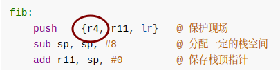
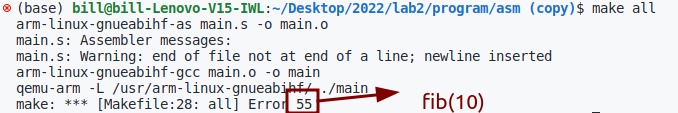

## 编写程序

>参考网站：
>
>- [arm system call table](https://chromium.googlesource.com/chromiumos/docs/+/master/constants/syscalls.md#arm-32_bit_EABI)
>
>- [arm-asm tutorial series](https://azeria-labs.com/memory-instructions-load-and-store-part-4/)

### 递归求斐波那契数列

- c代码

```c
#include <stdio.h>

int fib(int n)
{
    if (n <= 0)
        return 0;
    if (n < 2)
        return n;
    return fib(n - 1) + fib(n - 2);
}

int main()
{
    int n;
    scanf("%d", &n);
    return fib(n);
}
```

- 翻译得到汇编代码

```assembly
	.arch armv7-a
	.fpu vfpv3-d16
	.eabi_attribute 28, 1
	.eabi_attribute 20, 1
	.eabi_attribute 21, 1
	.eabi_attribute 23, 3
	.eabi_attribute 24, 1
	.eabi_attribute 25, 1
	.eabi_attribute 26, 2
	.eabi_attribute 30, 6
	.eabi_attribute 34, 1
	.eabi_attribute 18, 4
	.file	"main.c"
	.text
	.align	1	;这里使用的是thumb指令，2^1=2字节对齐
	.global	fib	;全局函数声明，相当于extern
	.syntax unified
	.thumb
	.thumb_func
	.type	fib, %function	;定义函数的类型
fib:
	@ args = 0, pretend = 0, frame = 8
	@ frame_needed = 1, uses_anonymous_args = 0
	push	{r4, r7, lr}
	sub	sp, sp, #12
	add	r7, sp, #0
	str	r0, [r7, #4]
	ldr	r3, [r7, #4]
	cmp	r3, #0
	bgt	.L2
	movs	r3, #0
	b	.L3
.L2:
	ldr	r3, [r7, #4]
	cmp	r3, #1
	bgt	.L4
	ldr	r3, [r7, #4]
	b	.L3
.L4:
	ldr	r3, [r7, #4]
	subs	r3, r3, #1
	mov	r0, r3
	bl	fib(PLT)
	mov	r4, r0
	ldr	r3, [r7, #4]
	subs	r3, r3, #2
	mov	r0, r3
	bl	fib(PLT)
	mov	r3, r0
	add	r3, r3, r4
.L3:
	mov	r0, r3
	adds	r7, r7, #12
	mov	sp, r7
	@ sp needed
	pop	{r4, r7, pc}
	.size	fib, .-fib
	.section	.rodata
	.align	2
.LC0:
	.ascii	"%d\000"
	.text
	.align	1
	.global	main
	.syntax unified
	.thumb
	.thumb_func
	.type	main, %function
main:
	@ args = 0, pretend = 0, frame = 8
	@ frame_needed = 1, uses_anonymous_args = 0
	push	{r7, lr}
	sub	sp, sp, #8
	add	r7, sp, #0
	ldr	r2, .L8
.LPIC1:
	add	r2, pc
	ldr	r3, .L8+4
	ldr	r3, [r2, r3]
	ldr	r3, [r3]
	str	r3, [r7, #4]
	mov	r3, #0
	mov	r3, r7
	mov	r1, r3
	ldr	r3, .L8+8
.LPIC0:
	add	r3, pc
	mov	r0, r3
	bl	__isoc99_scanf(PLT)
	ldr	r3, [r7]
	mov	r0, r3
	bl	fib(PLT)
	mov	r3, r0
	ldr	r1, .L8+12
.LPIC2:
	add	r1, pc
	ldr	r2, .L8+4
	ldr	r2, [r1, r2]
	ldr	r1, [r2]
	ldr	r2, [r7, #4]
	eors	r1, r2, r1
	mov	r2, #0
	beq	.L7
	bl	__stack_chk_fail(PLT)
.L7:
	mov	r0, r3
	adds	r7, r7, #8
	mov	sp, r7
	@ sp needed
	pop	{r7, pc}
.L9:
	.align	2
.L8:
	.word	_GLOBAL_OFFSET_TABLE_-(.LPIC1+4)
	.word	__stack_chk_guard(GOT)
	.word	.LC0-(.LPIC0+4)
	.word	_GLOBAL_OFFSET_TABLE_-(.LPIC2+4)
	.size	main, .-main
	.ident	"GCC: (Ubuntu 11.2.0-17ubuntu1) 11.2.0"
	.section	.note.GNU-stack,"",%progbits

```

- 手写arm汇编程序

```assembly
.global main

fib:
	push    {r4, r11, lr}   @ 保护现场
	sub sp, sp, #8  		@ 分配一定的栈空间
	add	r11, sp, #0 		@ 保存栈顶指针
	str	r0, [r11, #4]   	@ 存n
	cmp	r0, #1  			@ if (n<2) return n; else return fib(n-1)+fib(n-2);
	bgt	fib_recur
	b   fib_end
fib_recur:  				@ 递归调用
	ldr	r3, [r11, #4]   	@ r3 = n
	sub	r3, r3, #1  		@ r3 = n-1
	mov	r0, r3  			@ r0 = n-1
	bl	fib 				@ r0 = fib(n-1)
	mov	r4, r0  			@ r4 = fib(n-1)
	ldr	r3, [r11, #4]   	@ r3 = n
	sub	r3, r3, #2  		@ r3 = n-2
	mov	r0, r3  			@ r0 = n-2
	bl	fib 				@ r0 = fib(n-2)
	mov	r3, r0  			@ r3 = fib(n-2)
	add	r3, r3, r4  		@ r3 = fib(n-1)+fib(n-2)
fib_end:    				@ 结束
	mov	r0, r3 				@ r0 = fib(n)
	add	r11, r11, #8
	mov	sp, r11 			@ 恢复栈顶指针
	pop	{r4, r11, pc}   	@ 恢复现场

main:
    push {r11, lr}  		@ 保护现场
    add r11, sp, #0 		@ 保存栈顶指针
    mov r0, #10 			@ r0 = n = 10
    bl  fib 				@ r0 = fib(n)
    pop {r11, pc}   		@ 恢复现场
```

>注意：
>
>- 直接对n初始化，是原c代码的简化版
>
>- 通过对比直接编译得到的汇编代码，该部分必须保存r4，r4暂存了fib(n-1)的结果，并在之后运行完对fib(n-2)的求解后，才不会在递归调用中被修改。
>
>
>
>- 递归调用过程中必须保留n的值到内存中。递归调用的过程会不断修改fib函数开始时，保存参数n的寄存器0的值。

- 运行指令

  > ```
  > arm-linux-gnueabihf-as main.s -o main.o
  > arm-linux-gnueabihf-gcc main.o -o main
  > qemu-arm -L /usr/arm-linux-gnueabihf/ ./main
  > ```

- 运行结果



​	运行结果正确。
