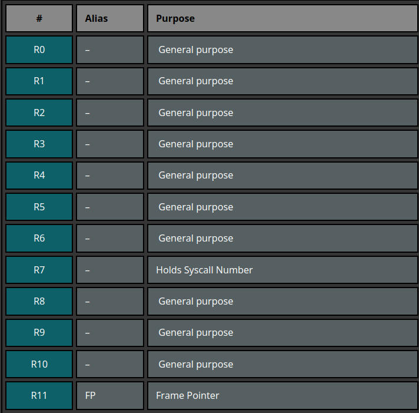
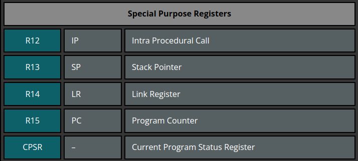
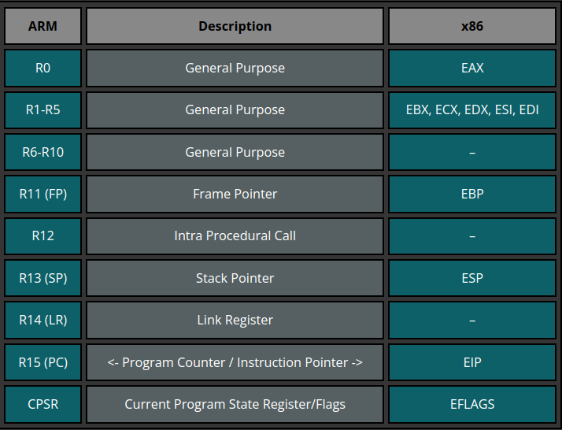
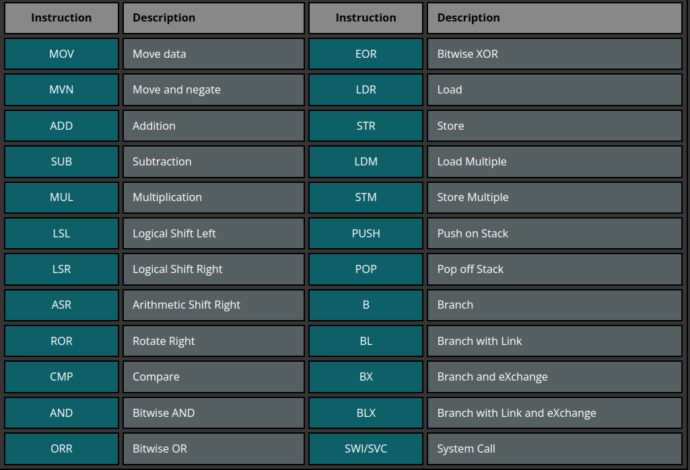

# ARM汇编语言

> 参考链接：[ARM Assembly Basics](https://azeria-labs.com/memory-instructions-load-and-store-part-4/)

### arm 寄存器

`Arm`一般在用户模式下可使用16个寄存器。根据使用目的可以分为两组。

它们与`x86`架构下寄存器的联系与区别为

### arm 常用指令集

