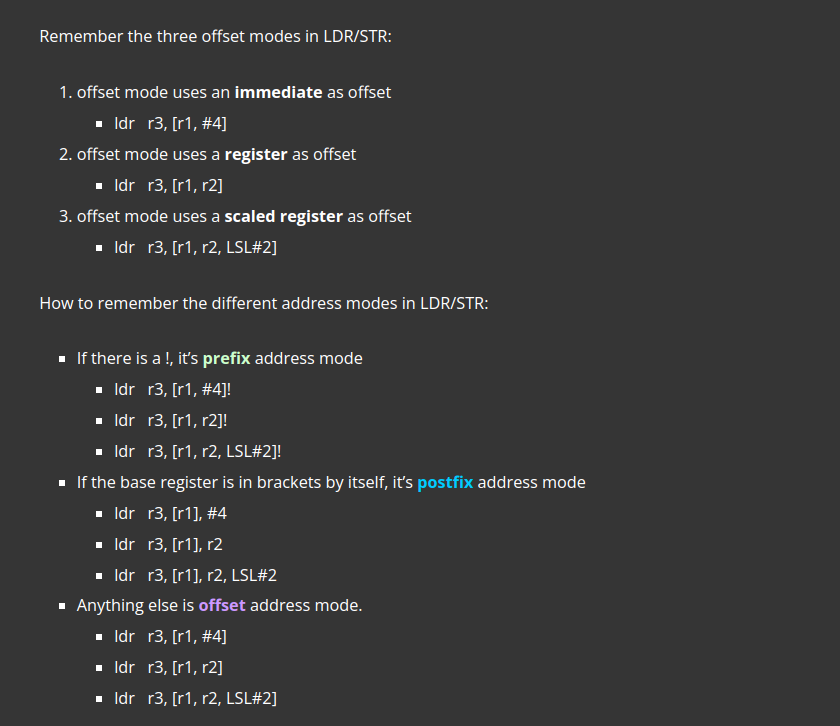
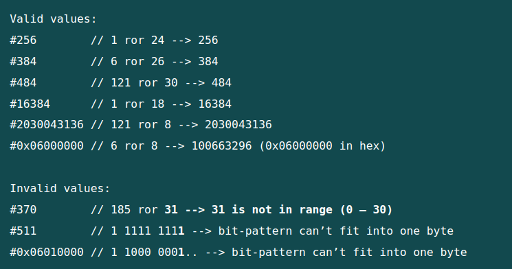
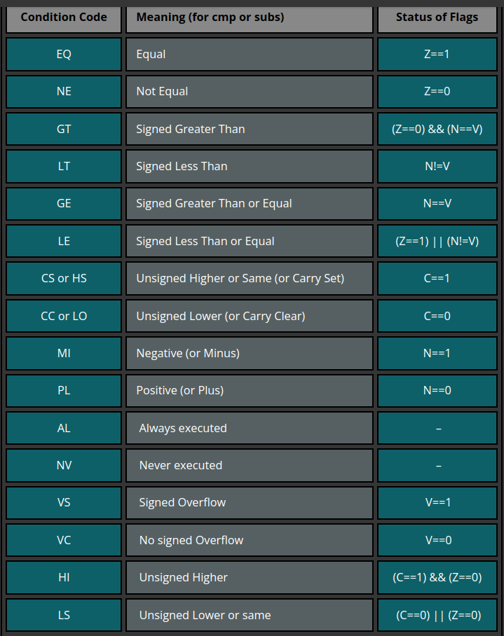

# ARM汇编语言

> 参考链接：[ARM Assembly Basics](https://azeria-labs.com/memory-instructions-load-and-store-part-4/)

### arm 寄存器

`Arm`一般在用户模式下可使用16个寄存器。根据使用目的可以分为两组。

它们与`x86`架构下寄存器的联系与区别为

### arm 常用指令集

### arm load/store

> 对立即数的使用
>
> - 一次只能加载8bit
> - 对于mov指令，立即数字段只有12位，由8位能直接使用的，以及表示右移位数的4位组成（取值0~30）
> - v = n ror 2^r
>
> 

### 条件分支语句

### 函数和栈

- prologue：保存现场，设置fp，sp

- body：

    > - 使用寄存器传递参数，超过4个参数，需要使用栈
    > - 返回值保存在r0中
    > - 结果超过32bit，可以结合r1返回

- epilogue：

    >- 还原现场，根据r11 fp寄存器
    >

